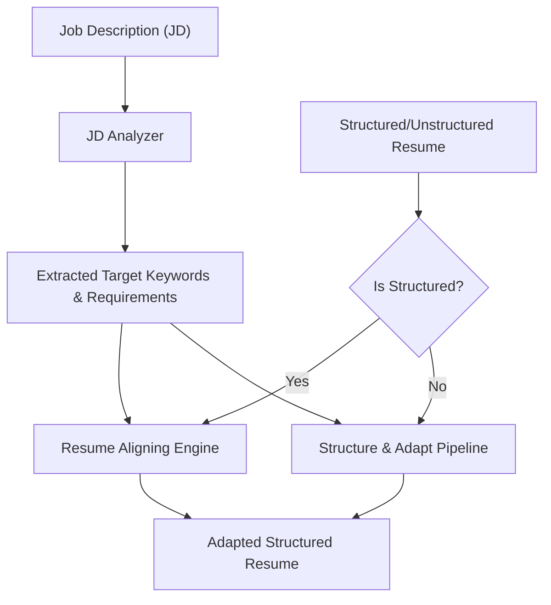

# Plan - AI Adaptation and Alignment Engine

This document outlines the design and architecture of the core adaptation service.

## Architecture

The engine coordinates job analysis and resume alignment through the Gemini API.

## Component Design

### 1. Gemini Client Wrapper (`internal/adaptation/client.go`)
- Wraps the official Google Gen AI SDK client.
- Loads configurations from environment variables (e.g., `GEMINI_API_KEY`).
- Enforces context timeout propagation and retries on transient errors.

### 2. Job Description Analyzer (`internal/adaptation/analyzer.go`)
- Receives the raw job description string.
- Prompts Gemini to identify and return a structured JSON response containing target keywords and responsibilities.

### 3. Alignment Engine (`internal/adaptation/adapter.go`)
- **For Structured Input:** Iterates through original job bullet points and skills, prompting Gemini to adapt phrasing to emphasize extracted keywords without fabricating experience.
- **For Unstructured Input:** Prompts Gemini to parse the raw text while simultaneously aligning it to the target keywords, producing the final adapted `Resume` struct in a single pass.

## Decisions
- **Fact Integrity**: Prompts must explicitly instruct the model to fail or ignore adaptation if it requires fabricating new achievements, projects, or employment history.
- **Model Choice**: Default to `gemini-1.5-flash` for high throughput, low latency, and lower token costs, while leaving the model name configurable.
