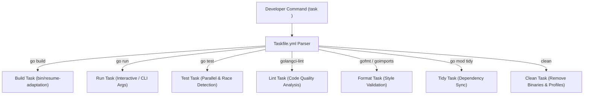

# Plan - Developer Taskfile

This document outlines the design and automation tasks configured in the Taskfile.yml to standardize the developer workflow.

## Architecture

The Taskfile acts as a task runner layer on top of Go tooling, linting, and formatting utilities. It provides a simple, platform-agnostic interface for developer commands.

## Component Design

### 1. Task Runner Setup (Taskfile.yml)
- Utilizes taskfile.dev schema (version '3').
- Configures task descriptions and flags to be self-documenting (available via "task --list").
- Uses cross-platform shell commands (supported natively by the Task Go-interpreter) to ensure compatibility across Linux, macOS, and Windows.

### 2. Task Declarations
- **build**: Compiles the primary binary to `bin/resume-adaptation`. Supports dynamic executable extension on Windows.
- **run**: Boots the application in development mode with custom CLI args passed via `CLI_ARGS`.
- **test**: Runs all test suites (`go test -v -race ./...`).
- **lint**: Runs static analysis check (`golangci-lint run ./...`).
- **fmt**: Code formatter applying `gofmt -s -w` and `goimports -w`.
- **tidy**: Cleans up unused or missing dependencies in `go.mod`.
- **clean**: Discards temporary build outputs, profile files, and cache.

## Decisions
- **Choose Task over Make**: Use Taskfile.yml because it avoids Makefile syntax issues on Windows, runs natively without requiring complex shell configurations, and offers clean dependency chaining.
- **Strict Lint Verification**: Make lint task block and fail early if style or quality rules configured in `.golangci.yml` are violated.
