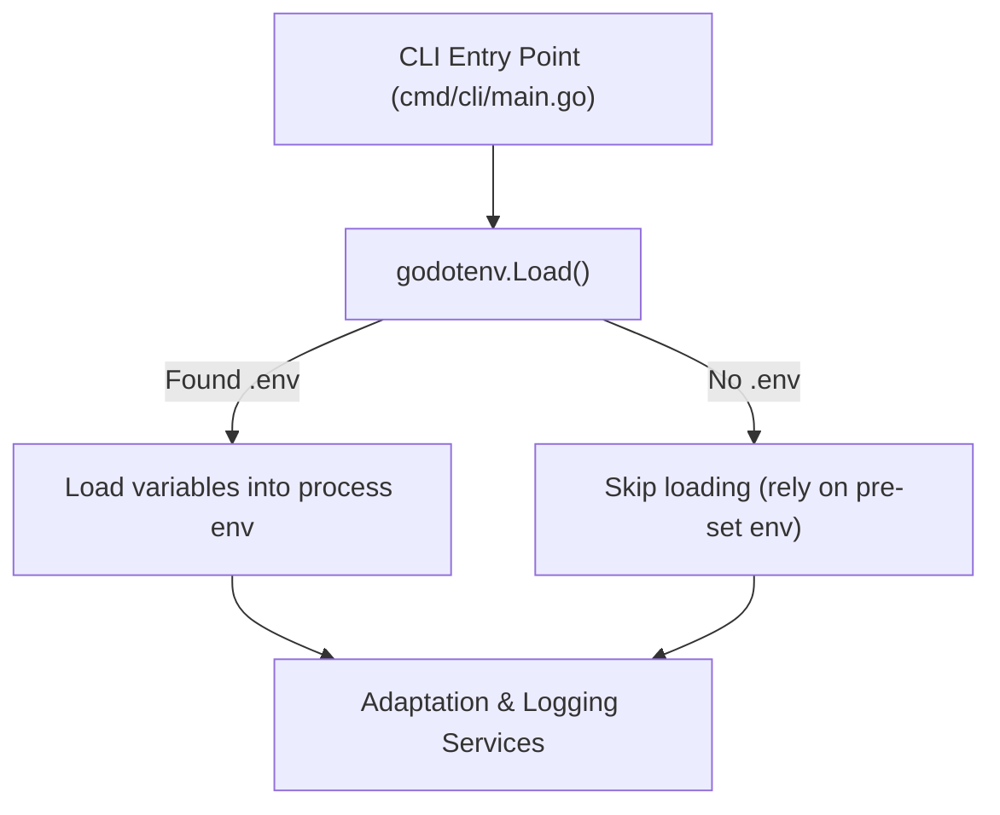

# Plan - Environment Configuration Support

This document outlines the design and integration of local environment variable configuration support using godotenv.

## Integration Flow

## Decisions
- Error Ignorance: The application will not fail if .env is missing (i.e. we ignore the error from godotenv.Load()). This ensures that in environments where variables are passed directly (like production or CI/CD pipelines), the application continues to run without error.
- Git Safety: Ensure that .env remains in .gitignore so developers don't accidentally check in real API keys.

## Tasks Reference
- Set up project dependency and template: See RAFT0035 in task.md.
- Bootstrap environment loading in application entry point: See RAFT0036 in task.md.
- Document configuration steps: See RAFT0037 in task.md.
