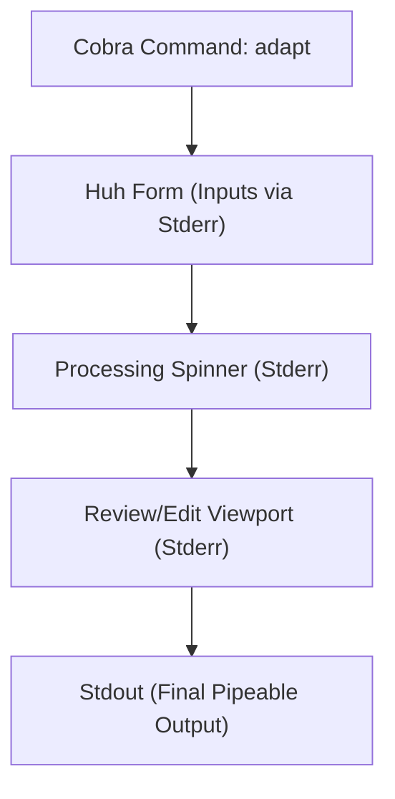

# Plan - Interactive UI Adaptation Wizard

This document outlines the design and architecture of the terminal-based interactive user interface, incorporating Go CLI best practices.

## Architecture

We will implement the user interface components in `internal/ui/` and bind them to a Cobra command in `cmd/cli/`.

## Component Design

### 1. Style Definitions (`internal/ui/styles.go`)
- Create Lipgloss style configurations (borders, colors, margins) implementing a premium, dark-mode terminal layout.

### 2. Interactive Input Forms (`internal/ui/form.go`)
- Use Charmbracelet's `Huh` library to create a sequence of input steps:
  - **File Ingest**: Prompt for the candidate's existing resume path.
  - **Job Description**: Select a JD file or paste raw text.
  - **Configurations**: Prompts for output path and API keys (if missing).
- Layer settings using Viper: command-line flag takes precedence over `GEMINI_API_KEY` env var, which takes precedence over config files.

### 3. Loading Component (`internal/ui/loader.go`)
- A responsive `Bubble Tea` program executing a text spinner while background API tasks run.

### 4. Interactive Review Screen (`internal/ui/review.go`)
- A viewport allowing the candidate to read the adapted resume bullets, see keyword matching, and make final edits to individual fields.

## CLI Integration & Best Practices
- **Command Definition**: Define the command `adaptCmd` using `RunE` (never `Run`) to allow standard error propagation.
- **Root Configuration**: Ensure `SilenceUsage: true` and `SilenceErrors: true` are set on the root command to avoid cluttering error reports with help guides.
- **I/O Separation**: Direct all interactive terminal prompts, forms, and loader graphics to `cmd.ErrOrStderr()` (Stderr). Keep `cmd.OutOrStdout()` (Stdout) reserved purely for final machine-readable outputs to support Unix pipeline redirection (e.g., `resume-adaptation adapt > output.md`).
- **Signal Handling**: Use `signal.NotifyContext` to capture interrupts (like Ctrl+C), enabling graceful termination and restoring the terminal cursor/state before exiting.

## Decisions
- **Decoupled Architecture**: Keep UI code strictly separated from the parser and AI logic. The UI components will call the engine services and handle only UI states.
- **Exit Codes**: Follow standard Unix exit codes: return `0` on success, `1` on general runtime error, and `2` on usage errors (invalid flags/arguments).
