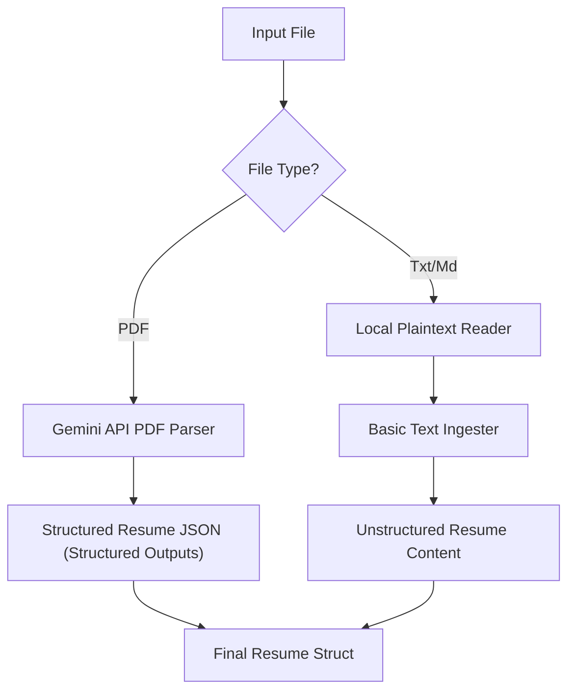

# Plan - Resume Ingestion and Parsing

This document outlines the design and architecture for the resume ingestion and parsing system, leveraging Gemini's native document understanding for PDF documents.

## Architecture

We will implement an ingestion service in `internal/parser/` that handles file reading.

## Component Design

### 1. Data Models
We will define structured Go models to represent the parsed resume:
- `Resume`: Container for candidate summary, experience, education, projects, and skills.
- `WorkExperience`: Company, job title, timeline, achievements, and responsibilities.
- `EducationInfo`: Institution, degree, major, and timeline.
- `ProjectInfo`: Project name, role, technologies, and description.

### 2. PDF Ingestion via Gemini API
For PDF resumes:
- Load the PDF file into memory.
- Call the Gemini API via the official Go SDK (`google.golang.org/genai`).
- Use Gemini's **Structured Outputs** feature to guarantee the model returns a response conforming exactly to our `Resume` JSON schema.
- Unmarshal the JSON response into our Go structs.

### 3. Plaintext Ingestion
For plaintext/markdown files:
- Read local files directly.
- Store the raw content in a flexible unstructured representation within our `Resume` model, which can be structured during the subsequent adaptation phase if necessary.

## Decisions
- **SDK choice**: Use the official `google.golang.org/genai` Go SDK, utilizing its newer interfaces for structured outputs and document uploads.
- **Fail-safe Logic**: Handle client authentication (API key validation), network/API timeouts, and schema validation errors gracefully.
