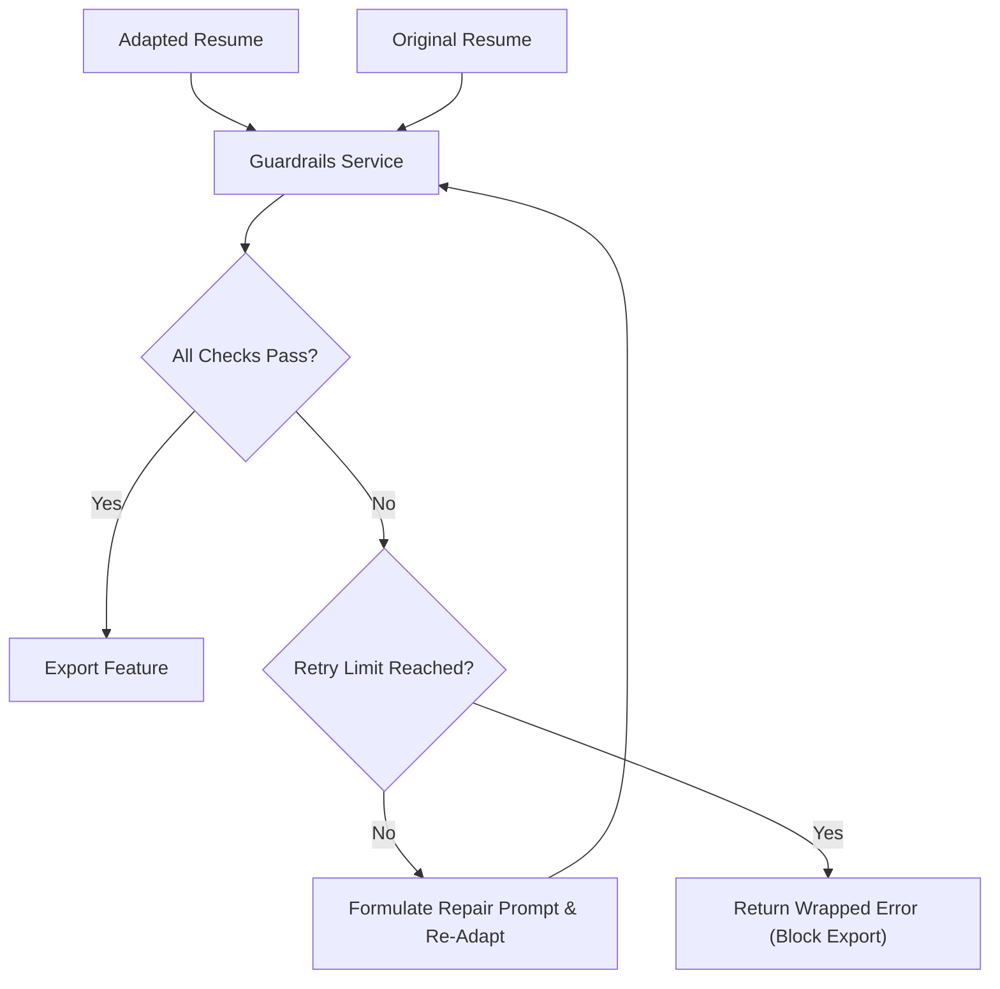

# Plan - Validation and Guardrails Agent

This document outlines the design and architecture of the validation and guardrails service.

## Architecture

The guardrails agent sits between the adaptation engine and the export engine, verifying the integrity of the generated resume.

## Component Design

### 1. Guardrail Service (`internal/adaptation/guardrails.go`)
- Defines the `Validator` interface.
- Runs the validation pipeline containing:
  - **Fact Consistency Validator**: Compares adapted resume against the original to detect hallucinations, exaggerations, or timeline discrepancies.
  - **Completeness Validator**: Verifies that required contact/profile fields are present.
  - **Formatting Validator**: Ensures markdown syntax and lists are valid.

### 2. Automated Repair Loop
- Tracks retry attempts (maximum 3).
- If a validation check fails, constructs a feedback prompt detailing the exact violations (e.g., "The candidate's original resume does not list Python as a skill, but bullet point 2 lists it. Please remove.") and passes it back to the adaptation engine.
- If it fails 3 times, halts execution and returns a descriptive error.

## Go Error Handling & CLI Integration
- **Error Wrapping**: Wrap all nested API errors, validation parser failures, and structural checks using `fmt.Errorf("{context}: %w", err)`.
- **Single Handling Rule**: Do not duplicate logs. If the validation fails, propagate the error up to the CLI command runner, letting the command handler write the user-friendly errors to Stderr.
- **Fail-Safe execution**: If validation fails critically, the CLI must block file export, print the validation error report to Stderr, and exit with code `1`.
