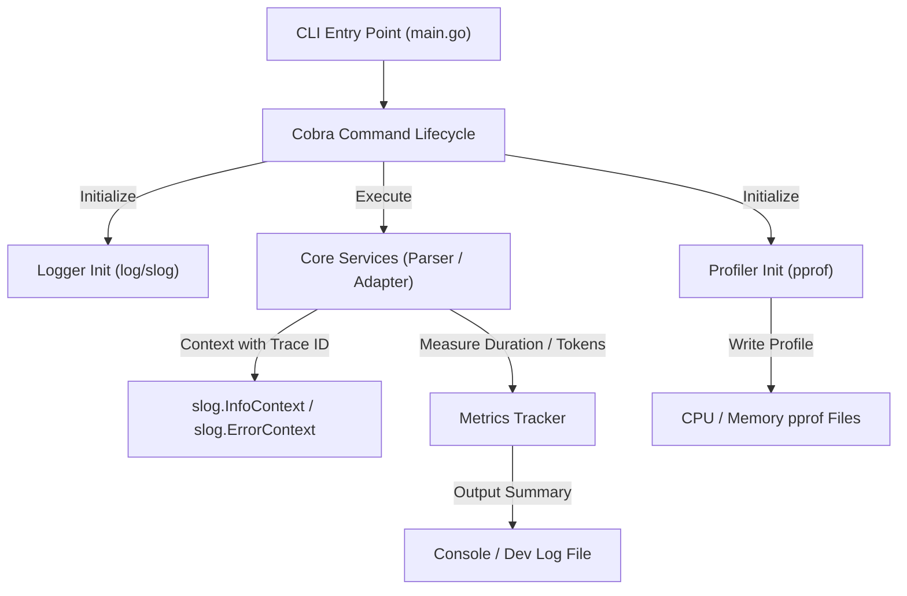

# Plan - Logging and Performance Monitoring

This document details the design and architecture of the developer-focused logging, performance metrics, and profiling instrumentation.

## Architecture

The observability system is layered across CLI command execution and core services, outputting structured logs and profiles for local debugging.

## Component Design

### 1. Logger Configurator (internal/observability/logger.go)
- Initializes standard Go "log/slog".
- Exposes options to set the output format (TEXT for dev-friendly command-line display, JSON for structured log collection).
- Configures log levels (DEBUG, INFO, WARN, ERROR) dynamically from flags or environment variables.

### 2. Profiling Controller (internal/observability/profile.go)
- Handles CPU and memory profiling activation.
- Integrates with CLI flags (e.g., --cpuprofile=<file> and --memprofile=<file>).
- Utilizes runtime/pprof to write runtime data, ensuring files are cleanly flushed and closed on exit.

### 3. Execution Metrics Tracker (internal/observability/metrics.go)
- Tracks execution timings for high-latency blocks: PDF parsing, Gemini API analysis, and adaptation.
- Tracks resource stats (character/token counts, error counts).
- Exposes an in-memory accumulator that outputs a summary at the end of execution when verbose flags are set.

## Decisions
- **Standard Library slog**: Avoid third-party logger dependencies (like zap or logrus) to keep binaries minimal and leverage standard library consistency.
- **Dynamic Context Logging**: Log statements in services must accept Context to support tracing and correlation.
- **Dev-First Metrics**: Focus on console-output metrics and file-based profiling rather than full Prometheus scrape endpoints, keeping in line with CLI application design.
