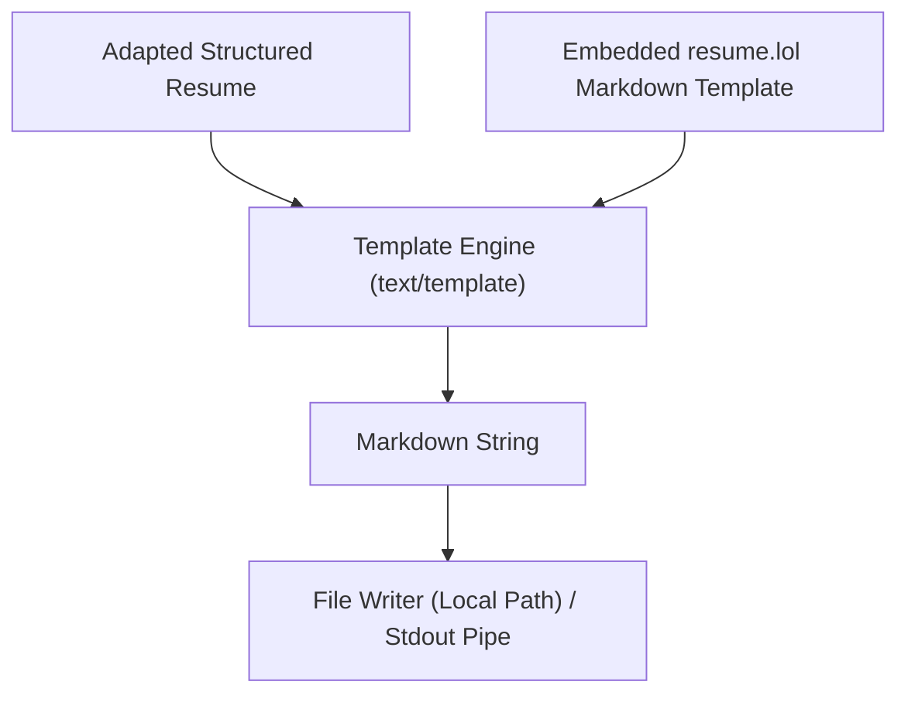

# Plan - Structured Export to resume.lol Format

This document outlines the design and architecture of the resume markdown exporter, incorporating Go security and CLI best practices.

## Architecture

We will implement the exporter in `internal/export/` using Go's standard template library.

## Component Design

### 1. Templating Engine (`internal/export/template.go`)
- Leverage Go's standard library `text/template` to ensure robust, secure, and fast rendering.
- Define a default embedded template matching the `resume.lol` Markdown guidelines:
  - Header: `# Name` followed by contact info grid (`[Link](URL)` formatting).
  - Sections: `## Work Experience`, `## Education`, `## Projects`, `## Skills`.
  - Content details: Company and roles highlighted using bolding (`**Company Name** - *Role*`), dates, and lists for bullet points.

### 2. Exporter Interface (`internal/export/exporter.go`)
- Create an `Exporter` struct that accepts a structured `Resume` model and outputs the rendered byte stream.
- Expose configurations for custom output paths.

## CLI Integration & Security Best Practices
- **I/O Separation**: Direct all diagnostic output, errors, and success notifications to `cmd.ErrOrStderr()` (Stderr). Keep `cmd.OutOrStdout()` (Stdout) reserved strictly for the generated Markdown stream. This ensures users can run command piping (e.g., `resume-adaptation export > resume.md`) safely.
- **Path Traversal Prevention**: Validate all export output paths and custom template paths. Since we are using Go 1.22+, validate paths using `filepath.IsLocal` or explicit boundary validation via `filepath.Rel` (ensuring the target does not resolve to parent `../` paths). Do not rely on `filepath.Clean` and `strings.HasPrefix` alone, which are vulnerable to separator mismatches.
- **Command Definition**: Define the subcommand using `RunE` with `SilenceUsage: true` and `SilenceErrors: true` on the command tree to cleanly manage execution failures.
